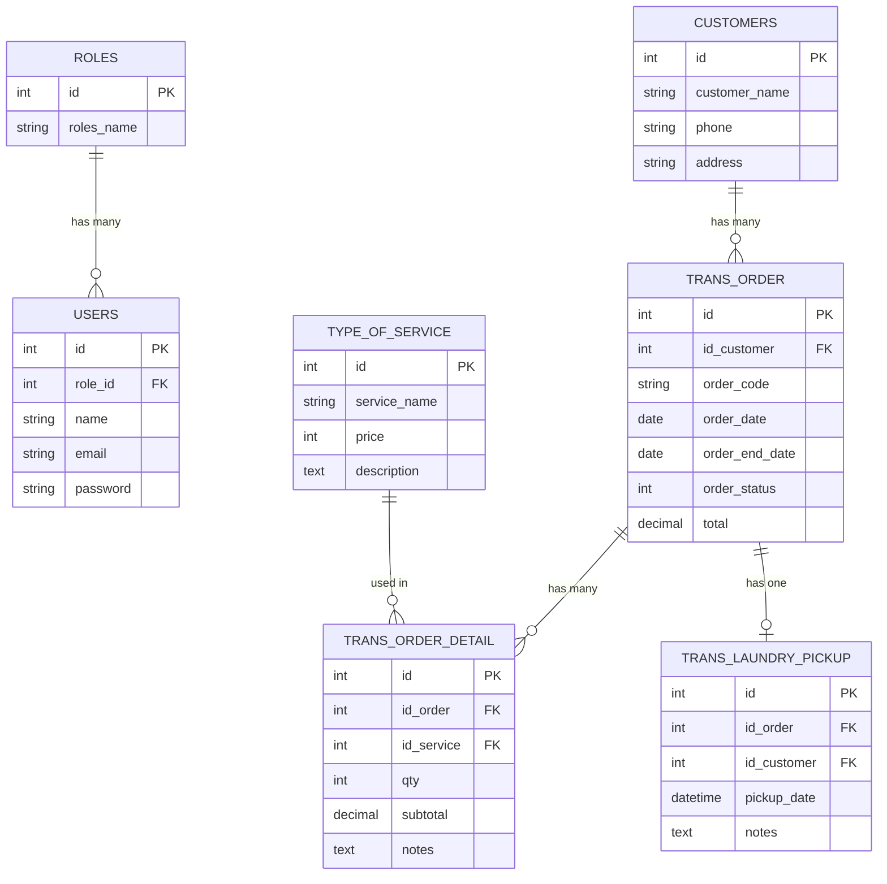
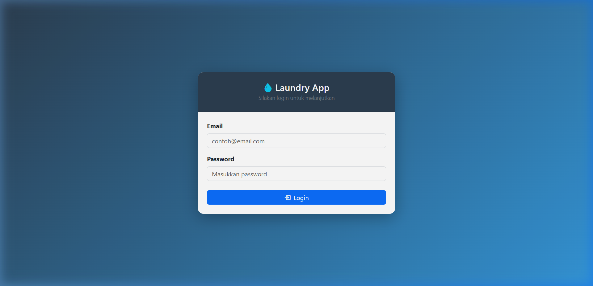
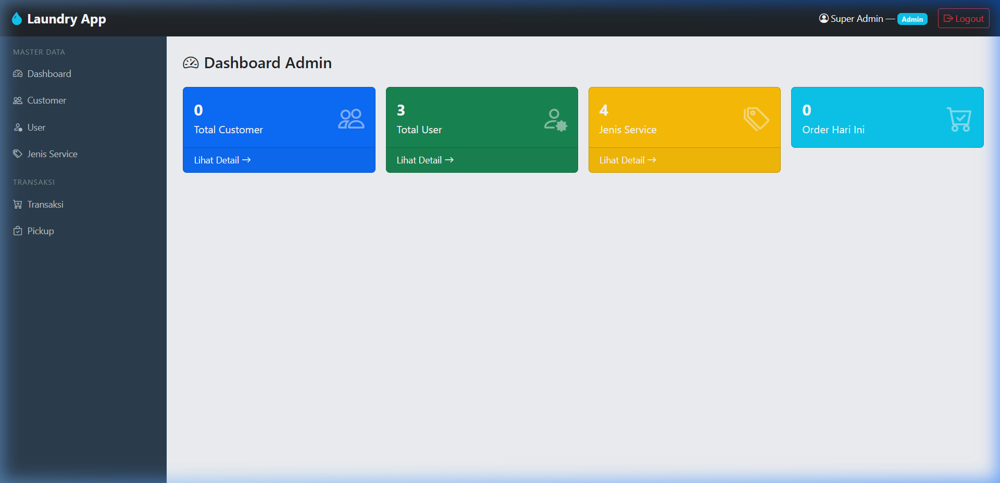
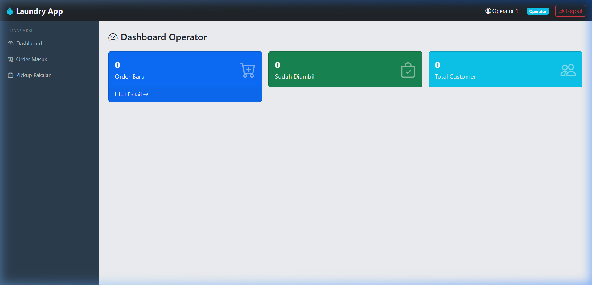
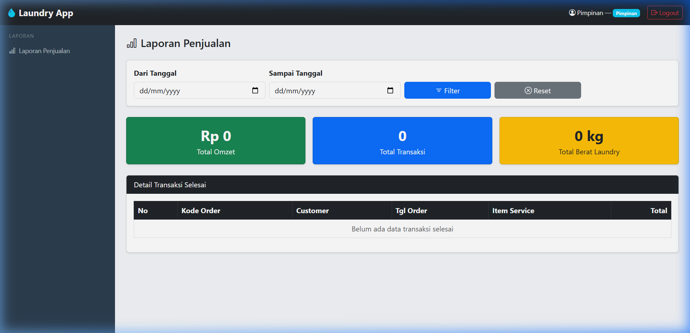
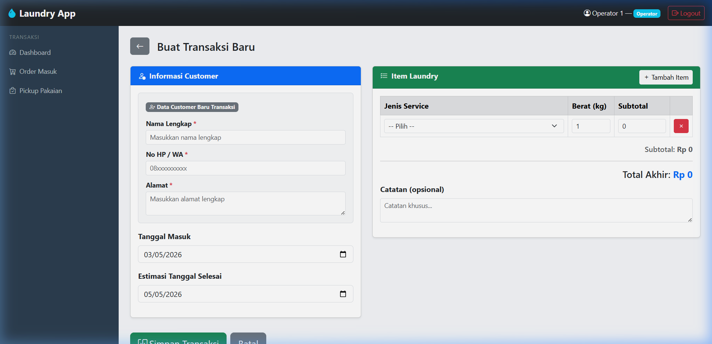

<p align="center">
  
</p>

<h1 align="center">🧺 Laundry Management System</h1>

<p align="center">
  Aplikasi manajemen laundry berbasis web dengan sistem multi-role untuk mengelola transaksi, pelanggan, layanan, dan laporan keuangan.
</p>

<p align="center">
  
  
  
  
  
</p>

---

## 📖 Tentang Project

**Laundry Management System** adalah aplikasi web full-stack yang dibangun menggunakan **Laravel 12** untuk mengelola operasional bisnis laundry secara digital. Aplikasi ini menerapkan arsitektur **MVC (Model-View-Controller)** dengan sistem **Role-Based Access Control (RBAC)** yang membagi akses berdasarkan 3 peran pengguna.

### 🎯 Tujuan
- Mendigitalisasi proses pencatatan transaksi laundry
- Mempermudah pengelolaan data pelanggan dan layanan
- Menyediakan laporan keuangan untuk pimpinan
- Menerapkan best practice pengembangan web dengan Laravel

---

## ✨ Fitur Utama

### 👨‍💼 Admin
| Fitur | Deskripsi |
|-------|-----------|
| Dashboard | Ringkasan total customer, user, service, dan order hari ini |
| Manajemen User | CRUD data user dengan role assignment |
| Manajemen Customer | CRUD data pelanggan |
| Manajemen Service | CRUD jenis layanan laundry beserta harga |

### 🧑‍💻 Operator
| Fitur | Deskripsi |
|-------|-----------|
| Buat Transaksi | Input order baru dengan pilihan layanan dan jumlah |
| Daftar Transaksi | Melihat semua riwayat transaksi |
| Detail Transaksi | Melihat detail lengkap per order |
| Pickup & Pembayaran | Proses pengambilan laundry dan pencatatan pembayaran |

### 📊 Pimpinan
| Fitur | Deskripsi |
|-------|-----------|
| Laporan Keuangan | Melihat laporan transaksi dengan filter tanggal |
| Total Omzet | Kalkulasi otomatis total pendapatan |

### 🔐 Fitur Umum
- **Autentikasi** — Login/logout dengan session-based authentication
- **Role Middleware** — Proteksi route berdasarkan role pengguna
- **Soft Deletes** — Data yang dihapus tidak hilang permanen dari database

---

## 📂 Struktur Project

```
WEB_MUHAMMAD_HILMY_LAUNDRY_APP/
├── app/
│   ├── Http/
│   │   ├── Controllers/
│   │   │   ├── AuthController.php        # Login, logout, session
│   │   │   ├── CustomerController.php     # CRUD pelanggan
│   │   │   ├── ServiceController.php      # CRUD jenis layanan
│   │   │   ├── UserController.php         # CRUD user & role
│   │   │   ├── TransaksiController.php    # Buat & lihat transaksi
│   │   │   ├── PickupController.php       # Proses pengambilan
│   │   │   ├── LaporanController.php      # Laporan keuangan
│   │   │   └── VoucherController.php      # Manajemen voucher
│   │   └── Middleware/
│   │       └── RoleMiddleware.php         # Guard akses per role
│   └── Models/
│       ├── User.php                       # Model user (extends Authenticatable)
│       ├── Roles.php                      # Model role (Admin/Operator/Pimpinan)
│       ├── Customer.php                   # Model pelanggan
│       ├── TypeOfService.php              # Model jenis layanan
│       ├── TransOrder.php                 # Model transaksi utama
│       ├── TransOrderDetail.php           # Model detail item per transaksi
│       ├── TransLaundryPickup.php         # Model catatan pengambilan
│       └── Voucher.php                    # Model voucher diskon
├── routes/
│   └── web.php                            # Definisi semua route aplikasi
├── resources/
│   └── views/
│       ├── auth/                          # Halaman login
│       ├── layouts/                       # Template utama (app.blade.php)
│       ├── admin/                         # Views untuk role Admin
│       ├── operator/                      # Views untuk role Operator
│       ├── customer/                      # Views untuk customer
│       └── pimpinan/                      # Views untuk role Pimpinan
├── database/
│   ├── migrations/                        # Schema tabel database
│   └── seeders/
│       └── DatabaseSeeder.php             # Data awal (roles, users, services)
├── config/                                # Konfigurasi Laravel
├── public/                                # Assets publik (CSS, JS, images)
├── composer.json                          # Dependencies PHP
└── README.md                              # Dokumentasi project (file ini)
```

---

## 🗄️ Entity Relationship



---

## 🚀 Instalasi & Menjalankan

### Prasyarat
- PHP >= 8.2
- Composer
- MySQL / MariaDB
- Node.js & NPM (untuk assets)

### Langkah-langkah

```bash
# 1. Clone repository
git clone https://github.com/Myy1703/WEB_MUHAMMAD_HILMY_LAUNDRY_APP.git
cd WEB_MUHAMMAD_HILMY_LAUNDRY_APP

# 2. Install dependencies PHP
composer install

# 3. Salin file environment
cp .env.example .env

# 4. Generate application key
php artisan key:generate

# 5. Konfigurasi database di file .env
#    Sesuaikan DB_DATABASE, DB_USERNAME, DB_PASSWORD

# 6. Jalankan migrasi dan seeder
php artisan migrate --seed

# 7. Install dependencies frontend & build assets
npm install && npm run build

# 8. Jalankan server
php artisan serve
```

Buka browser dan akses: **http://localhost:8000**

---

## 🔑 Akun Demo

| Role | Email | Password |
|------|-------|----------|
| **Admin** | `admin@laundry.com` | `admin123` |
| **Operator** | `operator@laundry.com` | `operator123` |
| **Pimpinan** | `pimpinan@laundry.com` | `pimpinan123` |

---

## 🛠️ Tech Stack

| Teknologi | Versi | Kegunaan |
|-----------|-------|----------|
| **Laravel** | 12.x | Backend framework (MVC) |
| **PHP** | 8.2+ | Server-side language |
| **MySQL** | 8.x | Relational database |
| **Blade** | - | Templating engine (views) |
| **Bootstrap** | 5.x | CSS framework (responsive UI) |
| **Vite** | - | Frontend build tool |

---

## 📸 Screenshots

> Berikut adalah tampilan aplikasi Laundry Management System:
>
> ### Halaman Login
> 
> 
> ### Dashboard Admin
> 
> 
> ### Dashboard Operator
> 
>
> ### Laporan Pimpinan
> 
>
> ### Form Transaksi Baru
> 

---

## 👤 Author

**Muhammad Hilmy**

---

<p align="center">
  Made with ❤️ using Laravel
</p>